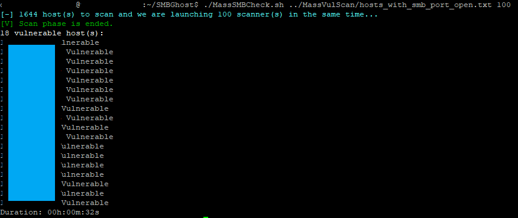

# SMBGhost + MassSMBCheck
Simple scanner for CVE-2020-0796 - SMBv3 RCE.

The scanner is for meant only for testing whether a server is vulnerable. It is not meant for research or development, hence the fixed payload. 

It checks for SMB dialect 3.1.1 and compression capability through a negotiate request.

A network dump of the scanner running against a Windows 2019 Server (10.0.0.133) can be found under `SMBGhost.pcap`. 

MassSMBCheck.sh adds the possibility of scanning in parallel as many desired hosts.

For example, 1644 hosts were scanned in 32 seconds:



## Usage
`python3 scanner.py <IP>`
Or for multiple hosts:
`./MassSMBCheck.sh <hosts file (IP)> <number of process>`

## Workarounds
[ADV200005 | Microsoft Guidance for Disabling SMBv3 Compression](https://portal.msrc.microsoft.com/en-US/security-guidance/advisory/adv200005)

```
Set-ItemProperty -Path "HKLM:\SYSTEM\CurrentControlSet\Services\LanmanServer\Parameters" DisableCompression -Type DWORD -Value 1 -Force
```

